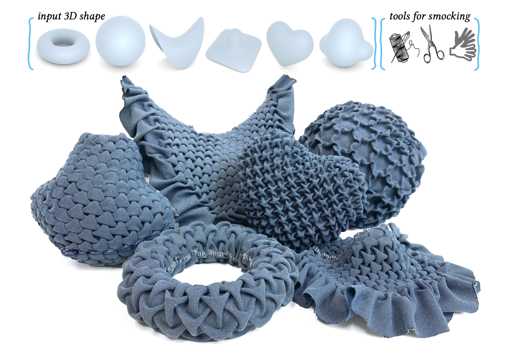
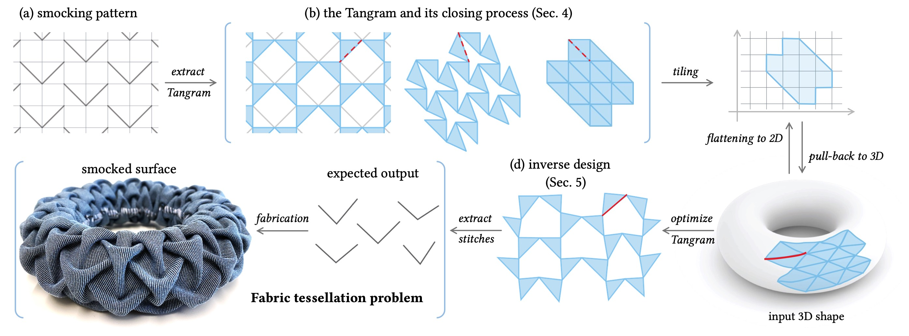

# Fabric Tessellation: Realizing Freeform Surfaces by Smocking

 

This repository contains the code for the paper "Fabric Tessellation: Realizing Freeform Surfaces by Smocking", accetped to SIGGRAPH 2024, by [Aviv Segall](https://segaviv.github.io), [Jing Ren](https://ren-jing.com/), [Amir Vaxman](https://avaxman.github.io/) and [Olga Sorkine-Hornung](https://igl.ethz.ch/people/sorkine).

In this project, we present a novel method for realizing freeform surfaces with pieces of flat fabric, where curvature is created by stitching together points on the fabric using a technique known as smocking. Smocking is renowned for producing intricate geometric textures with voluminous pleats. However, it has been mostly used to realize flat shapes or manually designed, limited classes of curved surfaces (e.g. see [Canadian smocking](https://github.com/llorz/SmockingDesign) and [Italian smocking](https://github.com/nifzhou/ItalianSmocking)). Our method combines the computation of directional fields with continuous optimization of a Tangram graph in the plane, which together allow us to realize surfaces of arbitrary topology and curvature with smocking patterns of diverse symmetries. Given a target surface and the desired smocking pattern, our method outputs a corresponding 2D smocking pattern that can be fabricated by sewing specified points together. The resulting textile fabrication approximates the target shape and exhibits visually pleasing pleats. We validate our method through physical fabrication of various smocked examples.

You can find more details at (coming soon): [[project page]]() | [[paper]]() | [[suppl. video]]() | [[slides]]()

## Problem Formulation & Algorithm Design

 

## Comments
### Acknowledgements
The authors would like to thank the anonymous reviewers for their valuable feedback. 
This work was supported in part by the ERC Consolidator Grant No. 101003104 (MYCLOTH).
Special thanks to ***Ningfeng Zhou*** for her assitance in fabricating the heart and cloud shapes, and to ***all members of IGL*** for their insightful discussions and kind support. 

### Contact
Please let us know (aviv.segall, jing.ren, @inf.ethz.ch) if you have any question regarding the algorithms/paper or you find any bugs in the code ε-(´∀｀; )
This work is licensed under a [Creative Commons Attribution-NonCommercial 4.0 International License](http://creativecommons.org/licenses/by-nc/4.0/). 
For any commercial uses or derivatives, please contact us (aviv.segall, jing.ren, sorkine, @inf.ethz.ch, avaxman, @inf.ed.ac.uk). 
